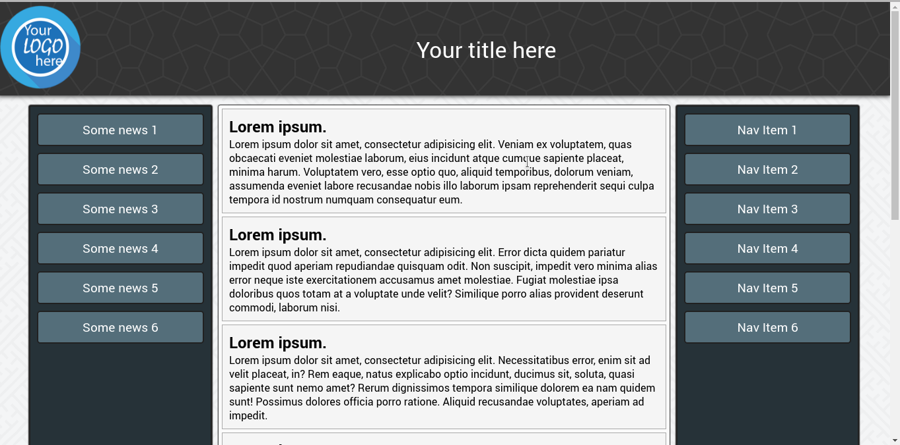
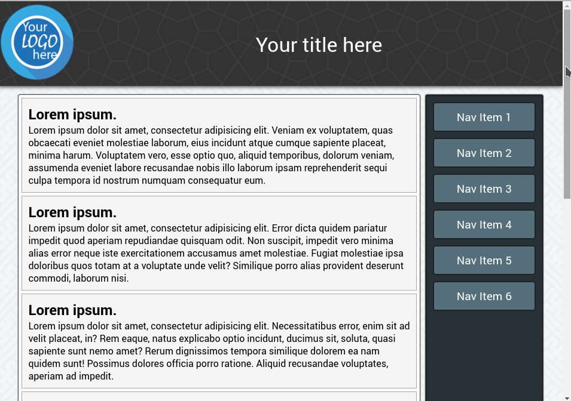
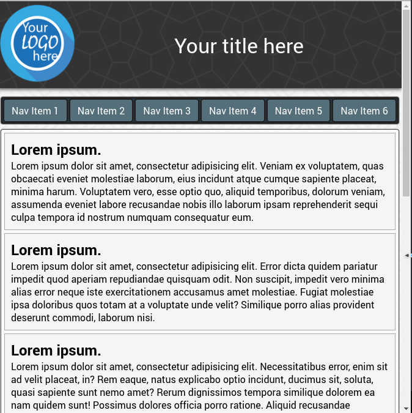

# Лабораторна робота №1

## Створення веб сторінки

### Розробив:

Студент групи ПІ-13-2 **Сакайлюк Ігор Миколайович**


### Перевірив:

**Броновський Ігор Васильович**

## Мета

Навчитися створювати адаптивні веб сторінки.

## Завдання

Створити веб сторінку згідно шаблону.


Не дозволяється використовувати сторонні бібліотеки. Сайт повинен мати адаптивний дизайн. Підтримувати мінімум екрани телефону, планшета та персонального комп’ютера.


## Хід роботи

### Лістинг веб сторінки

1. Розмітка
  ```html
  <!DOCTYPE html>
  <html lang="en">
  <head>
    <meta charset="UTF-8" />
    <link rel="stylesheet" href="stylesheets/main.css" />
    <title>Your website name here</title>
  </head>
  <body>
    <header>
      <div class="logo">
        
      </div>
      <div class="title">
        <snap>Your title here</snap>
      </div>
    </header>

    <div class="container">

      <nav class="news">
        <ul>
          <li>Some news 1</li>
          <li>Some news 2</li>
          <li>Some news 3</li>
          <li>Some news 4</li>
          <li>Some news 5</li>
          <li>Some news 6</li>
        </ul>
      </nav>

      <nav class="navigation">
        <ul>
          <li>Nav Item 1</li>
          <li>Nav Item 2</li>
          <li>Nav Item 3</li>
          <li>Nav Item 4</li>
          <li>Nav Item 5</li>
          <li>Nav Item 6</li>
        </ul>
      </nav>

      <main>
        <article>
          <h1>Lorem ipsum.
          </h1>
          <p>Lorem ipsum dolor sit amet, consectetur adipisicing elit. Veniam ex voluptatem, quas obcaecati eveniet molestiae laborum, eius incidunt atque cumque sapiente placeat, minima harum. Voluptatem vero, esse optio quo, aliquid temporibus, dolorum veniam, assumenda eveniet labore recusandae nobis illo laborum ipsam reprehenderit sequi culpa tempora id nostrum numquam consequatur eum.</p>
        </article>
        <article>
          <h1>Lorem ipsum.
          </h1>
          <p>Lorem ipsum dolor sit amet, consectetur adipisicing elit. Error dicta quidem pariatur impedit quod aperiam repudiandae quisquam odit. Non suscipit, impedit vero minima alias error neque iste exercitationem accusamus amet molestiae. Fugiat molestiae ipsa doloribus quos totam at a voluptate unde velit? Similique porro alias provident deserunt commodi, laborum nisi.</p>
        </article>
        <article>
          <h1>Lorem ipsum.
          </h1>
          <p>Lorem ipsum dolor sit amet, consectetur adipisicing elit. Necessitatibus error, enim sit ad velit placeat, in? Rem eaque, natus explicabo optio incidunt, ducimus sit, soluta, quasi sapiente sunt nemo amet? Rerum dignissimos tempora similique dolorem ea nam quidem sunt! Possimus dolores officia porro ratione. Aliquid recusandae voluptates, aperiam ad impedit.</p>
        </article>
        <article>
          <h1>Lorem ipsum.
          </h1>
          <p>Lorem ipsum dolor sit amet, consectetur adipisicing elit. Id ex perspiciatis, provident molestias, dicta officiis repudiandae eligendi officia illum dolore autem inventore porro? Blanditiis ad similique, maiores totam vel aperiam, quibusdam officia, nostrum non illum unde, quam placeat incidunt. Vel dolorum hic tempora officia deleniti voluptates repellendus reiciendis, beatae incidunt.</p>
        </article>
        <article>
          <h1>Lorem ipsum.
          </h1>
          <p>Lorem ipsum dolor sit amet, consectetur adipisicing elit. Id ex perspiciatis, provident molestias, dicta officiis repudiandae eligendi officia illum dolore autem inventore porro? Blanditiis ad similique, maiores totam vel aperiam, quibusdam officia, nostrum non illum unde, quam placeat incidunt. Vel dolorum hic tempora officia deleniti voluptates repellendus reiciendis, beatae incidunt.</p>
        </article>
        <article>
          <h1>Lorem ipsum.
          </h1>
          <p>Lorem ipsum dolor sit amet, consectetur adipisicing elit. Id ex perspiciatis, provident molestias, dicta officiis repudiandae eligendi officia illum dolore autem inventore porro? Blanditiis ad similique, maiores totam vel aperiam, quibusdam officia, nostrum non illum unde, quam placeat incidunt. Vel dolorum hic tempora officia deleniti voluptates repellendus reiciendis, beatae incidunt.</p>
        </article>
        <article>
          <h1>Lorem ipsum.
          </h1>
          <p>Lorem ipsum dolor sit amet, consectetur adipisicing elit. Id ex perspiciatis, provident molestias, dicta officiis repudiandae eligendi officia illum dolore autem inventore porro? Blanditiis ad similique, maiores totam vel aperiam, quibusdam officia, nostrum non illum unde, quam placeat incidunt. Vel dolorum hic tempora officia deleniti voluptates repellendus reiciendis, beatae incidunt.</p>
        </article>
      </main>

    </div>

    <footer>
      &copy; Copyrights 2016. All right reserved. Made by Ihor Sakaylyuk.
    </footer>
  </body>
  </html>
  ```

2 Стилі
  ```css
  * {
    margin: 0;
    padding: 0;
  }

  body {
    font-family: "Roboto", "Helvetica", sans-serif, serif;
    background-image: url('../images/bg.png');
  }

  header {
    align-items: center;
    animation-duration: 0.6s;
    animation-name: drop;
    background-image: url('../images/header.png');
    box-shadow: 0 0 10px 1px #212121;
    color: white;
    display: inline-flex;
    margin-bottom: 10px;
    width: 100%;
  }

  header .logo img {
    height: 128px;
    margin: 5px 0;
    width: 128px;
  }

  header .title {
    font-size: 34px;
    margin: auto;
  }

  .container {
    display: flex;
    flex-direction: row;
    flex-wrap: wrap-reverse;
    justify-content: center;
    overflow: hidden;
  }

  nav {
    background-color: #263238;
    border-radius: 3px;
    border: 2px solid #212121;
    box-shadow: 0 0 1px 1px #212121;
    color: white;
    margin: 5px;
    width: 20vw;
  }

  nav.news {
    animation-duration: 0.6s;
    animation-name: look_up_left;
    order: 1;
  }

  nav.navigation {
    animation-duration: 0.6s;
    animation-name: look_up_right;
    order: 3;
  }

  nav ul {
    list-style-type: none;
  }

  nav ul li {
    background-color: #546E7A;
    border-radius: 5px;
    border: 2px solid #212121;
    font-size: 1.2rem;
    height: 40px;
    line-height: 40px; 
    margin: 10px;
    padding: 3px;
    text-align: center;
    transition: all 0.3s ease-in-out;
    vertical-align: middle;
  }

  nav ul li:hover {
    background-color: #CFD8DC;
    color: black;
    cursor: pointer;
    transition: all 0.3s ease-in-out;
  }

  main {
    animation-duration: 0.6s;
    animation-name: scale;
    background-color: #FAFAFA;
    border-radius: 3px;
    box-shadow: 0 0 1px 1px #212121;
    margin: 5px;
    min-height: 100vh;
    order: 2;
    width: 50vw;
  }

  main article {
    background-color: #F5F5F5;
    border: 1px solid #AAA;
    margin: 5px;
    padding: 10px;
  }

  footer {
    background-color: #212121;
    border-radius: 3px;
    box-shadow: 0 0 1px 1px #212121;
    color: white;
    margin: 5px;
    padding: 12px 0;
    text-align: center;
  }

  @media screen and (max-width: 992px) {
    nav.news {
      display: none;
    }

    main {
      width: 70vw;
    }
  }

  @media screen and (max-width: 768px) {
    nav.navigation, .container main {
      width: 100vw;
    }
    
    nav.navigation > ul {
      align-items: center;
      display: flex;
      flex-wrap: wrap;
    }

    nav.navigation > ul > li {
      display: inline-block;
      font-size: 1rem;
      height: 25px;
      line-height: 25px;
      margin: 0;
      margin: auto;
      padding: 5px 12px;
    }
  }

  @keyframes drop {
    0% {
      opacity: 0;
      transform: translateY(-300px);
    }
    100% {
      opacity: 1;
      transform: translateY(1);
    }
  }

  @keyframes look_up_left {
    0% {
      opacity: 0;
      transform: translateX(-300px);
    }
    100% {
      opacity: 1;
      transform: translateX(1);
    }
  }

  @keyframes look_up_right {
    0% {
      opacity: 0;
      transform: translateX(300px);
    }
    100% {
      opacity: 1;
      transform: translateX(1);
    }
  }

  @keyframes scale {
    0% {
      opacity: 0;
      transform: scale(0.1);
    }
    100% {
      opacity: 1;
      transform: scale(1);
    }
  }
  ```

## Результат
### Desktop/Laptop


### Tablet


### Mobile


## Висновок: 

На цій лабораторній роботі я навчився створювати адаптивні веб сторінки використовуючи css-технології - flex-box та media-queries.


